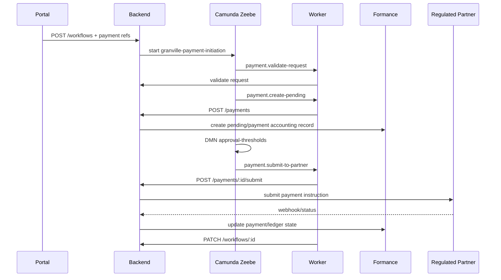
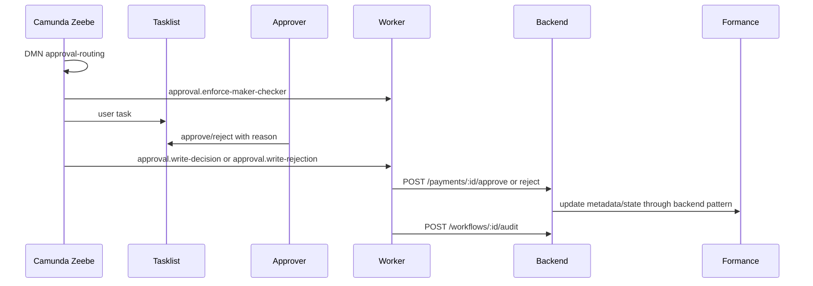
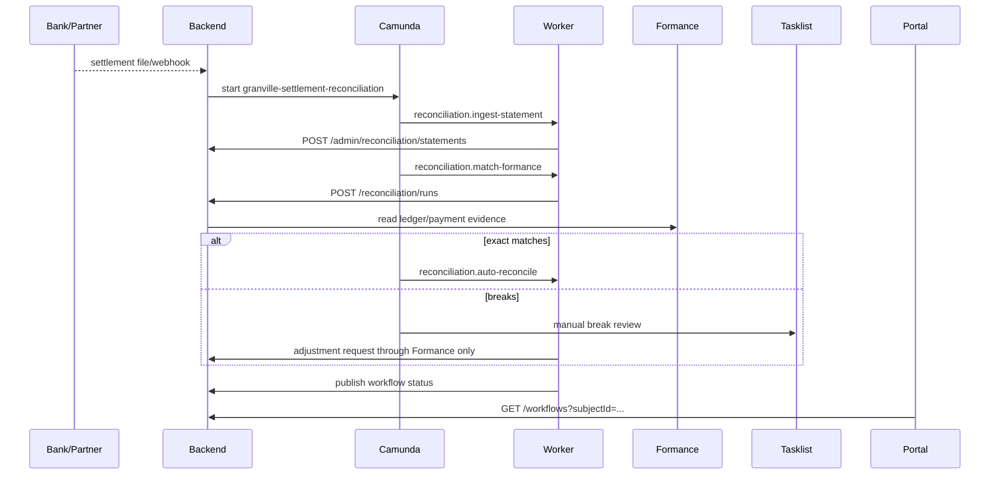
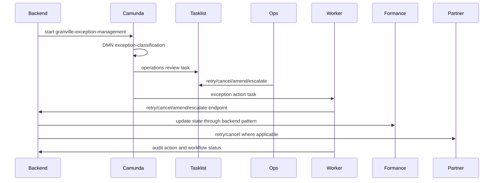

# Camunda Workflow Layer

Camunda is the operating system for financial workflows. Formance remains the financial system of record.

## Folder Structure

```text
apps/camunda-workers/
  src/
    backend-client.ts       # Calls Granville API only
    handlers.ts             # Zeebe service task handlers
    index.ts                # Worker registration entrypoint
    types.ts                # Minimal worker/client contracts

workflows/camunda/
  bpmn/                     # Executable BPMN process models
  dmn/                      # Decision tables for policy and routing

ops/camunda/
  docker-compose.camunda.yml

libs/contracts/workflow.ts  # Workflow tracking contracts
libs/db/migrations/0006_camunda_workflows.sql
```

## Ownership Boundary

| Domain | Owner | Notes |
|---|---|---|
| Ledger accounts, balances, postings, transaction IDs | Formance | Source of truth for monetary state |
| Payment order state and partner references | Granville backend + Formance | Backend updates state after partner/Formance operations |
| Workflow state, approvals, retries, escalation, manual review | Camunda | Camunda stores process metadata and operational state only |
| Partner API credentials | Backend secret manager | Never stored in Camunda variables |
| Human approval and exception queues | Camunda Tasklist | Decisions are written back to backend audit and metadata |
| Process monitoring and troubleshooting | Operate | No direct money movement |
| Operational reporting | Optimize | Use process metrics, not ledger truth |

## Camunda Variables

Allowed:

- `workflowInstanceId`
- `paymentOrderId`
- `customerId`
- `paymentAccountId`
- `amount`
- `asset`
- `currency`
- `riskScore`
- `partnerReferenceId`
- `reconciliationRunId`
- `exceptionId`
- non-sensitive routing and status fields

Not allowed:

- API keys, client secrets, webhook secrets, signing keys
- full bank account numbers unless already approved for Tasklist exposure
- raw settlement files containing sensitive counterparty data
- credentials for Formance or regulated partners

## Backend API Surface

Workflow tracking:

| Method | Path | Purpose |
|---|---|---|
| `POST` | `/workflows` | Start or register workflow tracking for a Camunda process instance |
| `GET` | `/workflows` | List workflow records for portal/admin display |
| `GET` | `/workflows/:id` | Read one workflow record |
| `PATCH` | `/workflows/:id` | Update status, Camunda key, and correlation IDs |
| `POST` | `/workflows/:id/audit` | Record worker/human workflow action |
| `GET` | `/workflows/:id/audit` | Read workflow audit trail |

Existing financial operations used by workers:

| Method | Path | Purpose |
|---|---|---|
| `POST` | `/payments` | Create pending payment order |
| `POST` | `/payments/:id/submit` | Submit through backend provider runtime |
| `POST` | `/payments/:id/approve` | Write approval and continue payment |
| `POST` | `/payments/:id/reject` | Write rejection and cancel payment |
| `POST` | `/payments/:id/retry` | Retry through backend |
| `POST` | `/payments/:id/cancel` | Cancel through backend |
| `POST` | `/admin/reconciliation/statements` | Ingest partner settlement data |
| `POST` | `/reconciliation/runs` | Match against provider/Formance records |

Every worker-triggered write must include an idempotency key:

```text
camunda:{processInstanceKey}:{elementInstanceKey}:{operation}
```

## Correlation IDs

The database tracks:

- Camunda process instance key
- Formance transaction/payment ID
- internal payment request/payment order ID
- partner reference ID
- reconciliation run ID
- exception ID

This lets support move from a Tasklist item to Operate, then to backend audit, then to Formance/partner evidence without guessing.

## Sequence Diagrams

### Payment Initiation



### Payment Approval



### Settlement Reconciliation



### Exception Management



## Security And Operational Controls

- Keep Formance credentials, partner credentials, and signing secrets outside Camunda variables.
- Use Identity groups for `ops`, `senior-ops`, `compliance`, and `admin`.
- Enforce maker-checker in the backend worker, not only in Tasklist assignment.
- Use idempotency keys for every backend write triggered by a worker.
- Use least-privilege backend tokens for workers in non-local environments.
- Correlate Camunda, backend, Formance, and partner references on every workflow record.
- Never make Camunda workers call regulated partner APIs directly unless that is the established backend connector pattern.
- Use Operate for failed job troubleshooting; retry only after backend idempotency and partner status are checked.
- Use Optimize for workflow SLAs and queue aging, not for ledger/balance truth.
- Retain workflow audit records alongside backend audit records for compliance review.
- Require TLS and real Identity/Keycloak client secrets outside local development.

## Local Development

Start the Camunda stack:

```sh
docker compose -f ops/camunda/docker-compose.camunda.yml up -d
```

Useful local ports:

- Zeebe gateway: `localhost:26500`
- Operate: `http://localhost:8082`
- Tasklist: `http://localhost:8083`
- Optimize: `http://localhost:8084`
- Identity: `http://localhost:8085`
- Keycloak: `http://localhost:18080`

The checked-in worker entrypoint registers task handlers without a live SDK dependency:

```sh
npm run start:camunda-workers
```

To connect to Zeebe, replace the local `LoggingWorker` adapter in `apps/camunda-workers/src/index.ts` with the Camunda 8 Node SDK worker client and pass jobs into `registerGranvilleCamundaWorkers`.
